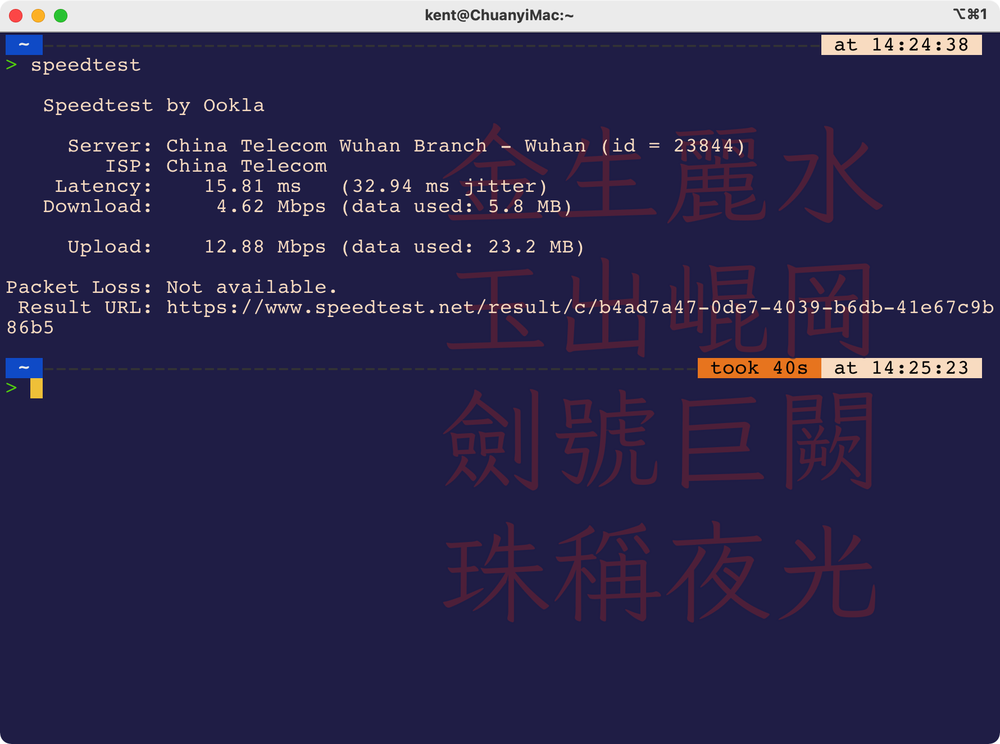

# 武汉咖啡馆移动办公网速测试

## 前言

近期有移动办公的需求，经常需要在武汉寻找合适的咖啡馆。我的需求很简单：好的网速、能充电、不太嘈杂的环境.etc。
但是网上查找了下发现大部分人的写作目的是探店打卡式的，很少有网速相关的精确描述。于是我打算简单记录一下到过的咖啡馆的网速，希望能给有类似需求的网友一个参考。
每条记录分为以下几部分：测试时间（间隔时间过长的可能参考意义大打折扣）、咖啡馆名称、地标性参考坐标、网速（带宽/下载速度）、体验（如果是连锁体验基本一致则跳过）
欢迎你加入这个 #武汉咖啡馆网速测试计划，提交issue。也欢迎如法炮制，为网友们贡献属于你所在城市的版本。

## 咖啡馆名录

### 2022-04-03 光谷世界城Wakanda 100M 带宽

光谷世界城wakanda，100M的宽带。相比星巴克，人并不是特别多，咖啡RMB15+相当便宜。不锈钢表面办公桌，高度适宜，板凳略硬，可充电。

### 2022-04-04 

光谷中建之星星巴克。P1带宽大约只有5M。P2是下载速度，大约是P1值除以8的规模，慢得有点超乎想象。
